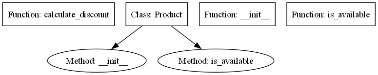

# Project Documentation

This documentation is auto-generated to help developers understand the structure and key components of the codebase.

##  Contents
- [API Documentation](API_DOCS.md)

##  Overview
This tool analyzes a Python codebase and auto-generates:
- Function and class documentation
- API endpoint mappings (from FastAPI decorators)
- Detected dependencies (`import`/`from` statements)
- Markdown-formatted technical documentation

## ⚙️ Setup Guide

1. **Clone your target repo or place `.py` files into `example_project/`**  
2. **Install Python 3.8+ and dependencies:**

```bash
pip install -r requirements.txt
```

3. **Run the bot:**

```bash
python main.py
```

4. **View generated files in:**

```
generated_docs/
├── README.md
└── API_DOCS.md
```

## 📊 Diagram


##  Sample Usage

Assume this code inside `example_project/sample.py`:

```python
def greet(name):
    """Greets the user with their name."""
    return f"Hello, {name}!"
```

The tool will generate:

```
## Function: `greet`
**File:** `example_project/sample.py`
**Arguments:** name
**Docstring:** Greets the user with their name.
```

##  Notes
- API routes are detected for FastAPI-like decorators (e.g., `@app.get("/path")`)
- Dependencies are extracted per file and shown in **API_DOCS.md**
- Files with syntax errors are skipped and printed in the terminal

##  Integration Guide
To use this bot in your own project:

1. Copy `code_parser.py`, `doc_generator.py`, and `interactive_bot.py` into your repo.
2. Point `main.py` to your repo path:

```python
repo_path = "your_codebase"
```

## ️ Troubleshooting
- If a file contains **syntax errors**, it will be skipped with an error shown in the terminal.
- Make sure uploaded `.py` files are **UTF-8 encoded** to avoid parsing issues.
- For API route detection to work, functions must use decorators like `@app.get("/route")`
- Ensure functions/classes have docstrings for better output

## 📌 Version
Current release: `v1.0.0`

